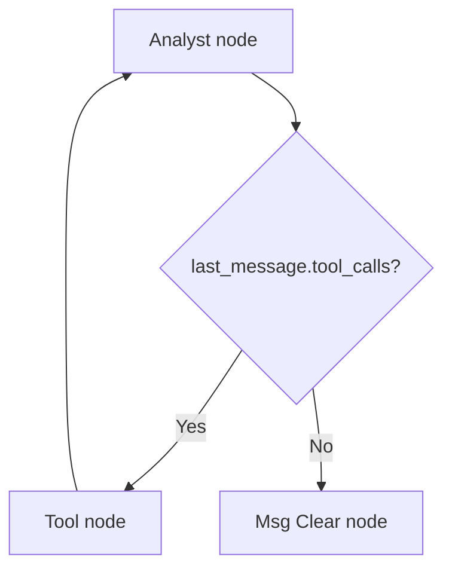
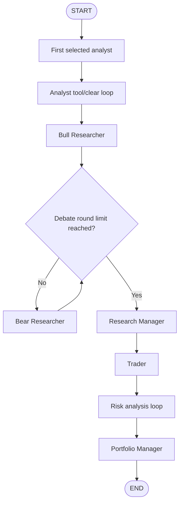

# TradingAgents 代码学习

## 核对结论

整体理解基本正确：`TradingAgentsGraph` 的核心确实是一个基于 LangGraph 的 `StateGraph` workflow，通过节点、边和条件路由把多个 agent 串成一次完整分析流程。

需要修正的点：
- `LangGraph` 拼写不是 `langraph`。
- 图的基础概念不止“4 个”：这里至少要区分 `StateGraph`、`state`、`node`、`edge`、`conditional edge`。
- `social` 是兼容旧配置的 key，实际 agent 节点名已经是 `Sentiment Analyst`。
- `create_msg_delete()` 不只是删除旧消息，还会追加一条带标的和日期上下文的 `HumanMessage`，避免下一个 agent 失去任务上下文。
- 当前嵌入图片 `![[Pasted image 20260707115635.png]]` 在 vault 中未找到，需要补回附件或重新截图。

主要对照源码：
- `repos/TradingAgents/tradingagents/graph/trading_graph.py`
- `repos/TradingAgents/tradingagents/graph/setup.py`
- `repos/TradingAgents/tradingagents/graph/analyst_execution.py`
- `repos/TradingAgents/tradingagents/graph/conditional_logic.py`
- `repos/TradingAgents/tradingagents/graph/propagation.py`
- `repos/TradingAgents/tradingagents/agents/utils/agent_utils.py`

## 1. 整体框架

`TradingAgentsGraph` 是入口编排类。初始化时主要完成这些事情：

1. 读取配置，并创建数据缓存目录、结果目录。
2. 通过 `_get_provider_kwargs()` 准备不同 LLM provider 的参数。
3. 通过 `create_llm_client()` 创建两类 LLM：
   - `deep_thinking_llm`
   - `quick_thinking_llm`
4. 通过 `_create_tool_nodes()` 创建不同分析师可调用的数据工具节点。
5. 初始化 `ConditionalLogic`、`GraphSetup`、`Propagator`、`Reflector`、`SignalProcessor`。
6. 调用 `graph_setup.setup_graph(selected_analysts)` 构建 `StateGraph`。
7. 调用 `workflow.compile()` 得到可运行的 LangGraph 图。

## 2. 关键函数和对象

### `_get_provider_kwargs()`

用于为 LLM client 准备 provider-specific 参数：

| Provider | 参数 |
|---|---|
| `google` | `thinking_level` |
| `openai` | `reasoning_effort` |
| `anthropic` | `effort` |
| 通用 | `temperature`、`max_retries` |

### `create_llm_client()`

根据 `provider`、`model`、`base_url` 和 provider kwargs 创建 LLM client。

在 `TradingAgentsGraph` 中会调用两次：
- `deep_client`：用于深度思考模型。
- `quick_client`：用于快速思考模型。

### `_create_tool_nodes()`

返回 `dict[str, ToolNode]`，为不同分析师绑定可调用工具。

| Key | 对应工具 |
|---|---|
| `market` | `get_stock_data`、`get_indicators`、`get_verified_market_snapshot` |
| `social` | `get_news` |
| `news` | `get_news`、`get_global_news`、`get_insider_transactions`、`get_macro_indicators`、`get_prediction_markets` |
| `fundamentals` | `get_fundamentals`、`get_balance_sheet`、`get_cashflow`、`get_income_statement` |

注意：`social` 是历史兼容 key，图里的 agent 节点名是 `Sentiment Analyst`。

### `ConditionalLogic`

用于判断图下一步走向。

分析师节点的通用逻辑：
- 如果 `last_message.tool_calls` 存在，进入对应 `tools_*` 工具节点。
- 如果没有工具调用，进入对应 `Msg Clear *` 清理节点。

其他条件路由：
- `should_continue_debate()`：在 `Bull Researcher` 和 `Bear Researcher` 之间轮转，达到 `2 * max_debate_rounds` 后进入 `Research Manager`。
- `should_continue_risk_analysis()`：在 `Aggressive Analyst`、`Conservative Analyst`、`Neutral Analyst` 之间轮转，达到 `3 * max_risk_discuss_rounds` 后进入 `Portfolio Manager`。

### `GraphSetup`

负责真正建图：
- 创建 `StateGraph(AgentState)`。
- 添加分析师节点、工具节点、消息清理节点。
- 添加研究员、交易员、风险分析员和组合经理节点。
- 定义普通边和条件边。

`setup_graph(selected_analysts)` 返回尚未 compile 的 `workflow`。

### `Propagator`

负责图运行前的状态初始化和运行参数：

- `create_initial_state()`：生成初始 `AgentState`。
- `get_graph_args()`：返回图运行参数，目前包含：
  - `stream_mode: "values"`
  - `config.recursion_limit`

初始 state 中包含：
- `messages`
- `company_of_interest`
- `asset_type`
- `instrument_context`
- `trade_date`
- `past_context`
- `investment_debate_state`
- `risk_debate_state`
- `market_report`
- `fundamentals_report`
- `sentiment_report`
- `news_report`

### `build_analyst_execution_plan()`

根据 `selected_analysts` 生成有序的 `AnalystExecutionPlan`。

每个分析师会被展开为一个 `AnalystNodeSpec`：

| Key | Agent node | Clear node | Tool node | Report key |
|---|---|---|---|---|
| `market` | `Market Analyst` | `Msg Clear Market` | `tools_market` | `market_report` |
| `social` | `Sentiment Analyst` | `Msg Clear Sentiment` | `tools_social` | `sentiment_report` |
| `news` | `News Analyst` | `Msg Clear News` | `tools_news` | `news_report` |
| `fundamentals` | `Fundamentals Analyst` | `Msg Clear Fundamentals` | `tools_fundamentals` | `fundamentals_report` |

如果传入未知 key，会抛出 `ValueError`。如果没有选择任何分析师，也会抛出 `ValueError`。

### `create_msg_delete()`

`create_msg_delete()` 返回一个 `delete_messages(state)` 函数。

它做两件事：
1. 用 `RemoveMessage` 删除当前 `messages` 中的旧消息。
2. 追加一条新的 `HumanMessage`，内容包含：
   - 继续当前 workflow 的指令
   - 标的上下文 `instrument_context`
   - 分析日期 `trade_date`

这一步的作用不是简单“清空聊天记录”，而是给下一个 agent 一个干净但仍然有上下文的输入，避免模型把 `"Continue"` 之类的占位文本误解成用户任务。
## 3. LangGraph 图概念

在这份代码里，可以按下面 5 个概念理解：

1. `StateGraph`：图定义对象，描述有哪些节点、边和状态类型。
2. `state`：图运行时共享数据，类型是 `AgentState`。
3. `node`：处理函数，输入 state，返回 state 增量。
4. `edge`：固定流转路径，从一个节点到另一个节点。
5. `conditional edge`：条件边，根据 state 和路由函数决定下一个节点。

## 4. 分析师执行链

构建图时，`setup_graph()` 会先执行：

```python
plan = build_analyst_execution_plan(selected_analysts)
```

然后按 `plan.specs` 的顺序添加每个分析师的三个节点：
- `agent_node`
- `tool_node`
- `clear_node`

每个分析师的执行模式是：



整体主流程可以简化为：



更具体地说：
- `START` 连接到第一个被选择的分析师。
- 每个分析师如果需要工具，就走到自己的 `tools_*` 节点，再回到该分析师。
- 每个分析师如果不需要工具，就进入 `Msg Clear *`，然后连接到下一个分析师。
- 最后一个分析师清理完消息后，进入 `Bull Researcher`。
- 研究辩论结束后进入 `Research Manager`。
- `Research Manager` 输出后进入 `Trader`。
- `Trader` 后进入风险分析循环。
- 风险分析结束后进入 `Portfolio Manager`，最后到 `END`。


