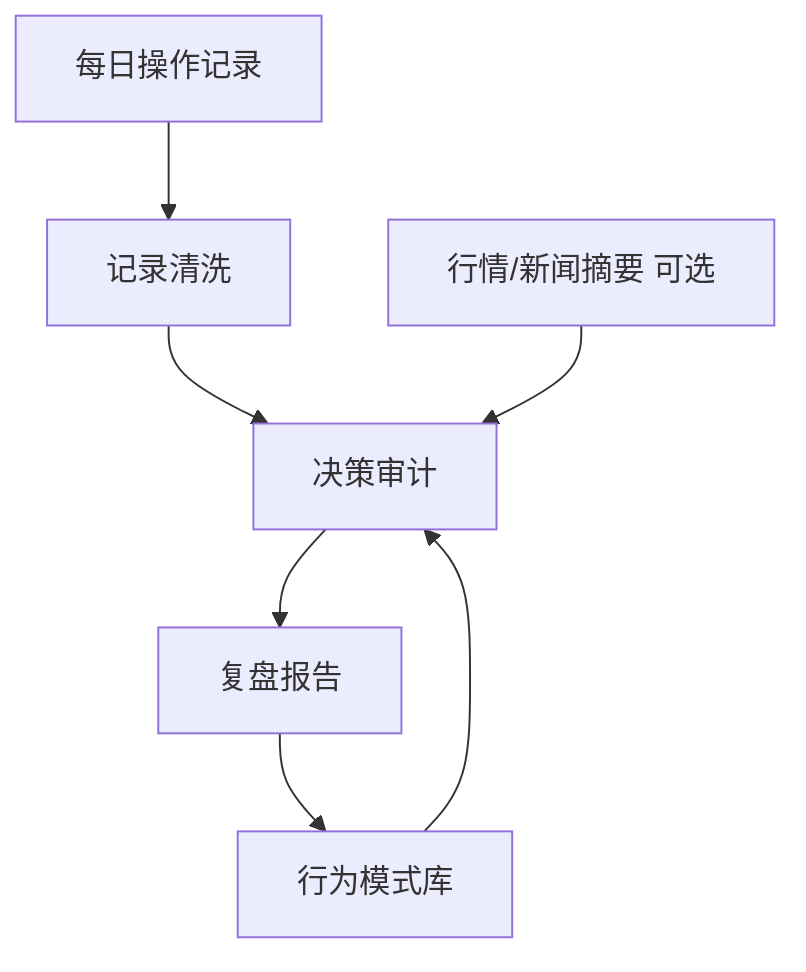

# 金融 Agent 两周学习计划

## 主线

这两周只做一个方向：**个人操作复盘 Agent**。

它不负责预测行情，也不直接给买卖建议。它的核心价值是读取我每天的操作记录，帮助我复盘：

- 当时为什么操作。
- 是否符合原计划。
- 是否存在情绪、信息缺口、执行偏差和风控缺失。
- 结果好坏分别来自运气、市场环境还是决策质量。
- 下次遇到类似场景前，应该检查什么。

> [!warning]
> 本计划只用于学习工程、Agent 设计和个人复盘，不构成任何投资建议。

## 参考材料

- [daily_stock_analysis Agent 学习计划](repos/daily_stock_analysis/docs/agent-learning-plan.md)
  - 借鉴点：运行入口、金融数据链路、Agent ReAct 循环、工具注册、结构化报告、数据质量和后验评估。
- [TradingAgents 中文学习计划](repos/TradingAgents/LEARNING_PLAN_zh.md)
  - 借鉴点：LangGraph 编排、多角色分工、AgentState、风险辩论、Portfolio Manager、memory log、checkpoint。

这两个项目都不是直接照抄对象：

- `daily_stock_analysis` 更适合学“产品化金融分析系统”：数据、报告、Web/API/通知、工具调用。
- `TradingAgents` 更适合学“研究型多 Agent 决策系统”：状态流、角色辩论、风控、记忆和可恢复性。
- 我的目标是把它们收敛成一个更小的系统：**操作记录 → 决策审计 → 复盘报告 → 行为模式库**。

## 最小产品

第一版只做 Obsidian 驱动的复盘闭环：



第一版不做：

- 自动下单。
- 收益预测。
- 复杂回测。
- 多账户同步。
- 对接真实券商 API。
- 自动评价“该不该买”，只评价“当时决策质量如何”。

## 节奏调整

现在按**带读学习型**推进，不按高压交付型推进。

原因：

- 我之前没有系统学习过 Agent，直接要求每天产出设计、模板、demo，负担偏大。
- 工作日时间有限，学习目标应该是“每天看懂一个小模块”，而不是“每天完成一个工程交付”。
- 复盘 Agent 是最终方向，但前两周更重要的是建立 Agent 工程直觉：入口、状态、工具、角色、输出、记忆。

每天最小要求：

- 工作日：只看 1 个文件或 1 个小模块，30-40 分钟。
- 学习产出：写 5-10 行“我看懂了什么 / 还没懂什么 / 对复盘 Agent 有什么启发”。
- 周末：只做一次汇总，把零散理解整理成图、表或模板。

降级规则：

- 状态好：看 1-2 个文件，写一段结构化笔记。
- 状态一般：只看 1 个函数或 1 个类，写 5 行理解。
- 状态差：只让我带你读 README 或学习计划中的一小节，不要求产出。

## 每日带读方式

每天你可以直接发：

```text
开始今天的金融 Agent 带读
```

我会按这个流程带你看：

1. 先告诉你今天只看哪 1 个文件，以及它在系统中的位置。
2. 用 3-5 句话解释这个文件解决什么问题。
3. 带你顺着关键函数/类看调用链，不逐行淹没。
4. 标出 2-3 个必须理解的概念。
5. 最后帮你把当天理解写进学习计划的 `## 阶段笔记`，或者写成单独带读记录。

每天带读结束时，只保留三个结果：

- 今日看了什么：
- 我真正理解了什么：
- 这个设计对复盘 Agent 的启发：

## 四条学习线

### 1. 运行入口与流程编排

目标：知道一次请求如何从入口进入 Agent 流程，最后生成报告。

重点文件：

- `repos/daily_stock_analysis/main.py`
- `repos/daily_stock_analysis/src/core/pipeline.py`
- `repos/daily_stock_analysis/src/agent/factory.py`
- `repos/TradingAgents/main.py`
- `repos/TradingAgents/tradingagents/graph/trading_graph.py`
- `repos/TradingAgents/tradingagents/graph/setup.py`
- `repos/TradingAgents/tradingagents/graph/conditional_logic.py`

迁移到复盘 Agent：

- 我的入口可以先是一个 Markdown 文件路径。
- 第一版不需要复杂图编排，但要清楚拆成哪些阶段：读取、清洗、审计、生成、沉淀。

### 2. 数据链路与事实约束

目标：学会让 Agent 基于事实复盘，而不是凭空解释。

重点文件：

- `repos/daily_stock_analysis/data_provider/`
- `repos/daily_stock_analysis/src/services/analysis_context_builder.py`
- `repos/daily_stock_analysis/docs/analysis-context-pack.md`
- `repos/TradingAgents/tradingagents/dataflows/interface.py`
- `repos/TradingAgents/tradingagents/agents/utils/agent_utils.py`
- `repos/TradingAgents/tests/test_news_lookahead.py`
- `repos/TradingAgents/tests/test_market_data_validator.py`

迁移到复盘 Agent：

- 操作记录是第一事实来源。
- 行情、新闻、财报只能作为背景，不允许覆盖原始操作动机。
- 缺少价格、理由、仓位时，复盘报告必须写“无法判断”，不能补脑。

### 3. Agent 角色与风险反驳

目标：理解多 Agent 不是角色扮演，而是职责隔离。

重点文件：

- `repos/daily_stock_analysis/src/agent/executor.py`
- `repos/daily_stock_analysis/src/agent/runner.py`
- `repos/daily_stock_analysis/src/agent/orchestrator.py`
- `repos/daily_stock_analysis/src/agent/agents/risk_agent.py`
- `repos/TradingAgents/tradingagents/agents/analysts/`
- `repos/TradingAgents/tradingagents/agents/researchers/`
- `repos/TradingAgents/tradingagents/agents/risk_mgmt/`
- `repos/TradingAgents/tradingagents/agents/managers/portfolio_manager.py`

迁移到复盘 Agent：

| 角色 | 职责 | 第一版是否需要 |
|---|---|---|
| 记录清洗员 | 从操作记录提取结构化事件 | 必须 |
| 事实检查员 | 检查价格、时间、标的、信息来源是否充分 | 可选 |
| 决策审计员 | 判断计划一致性、风控、执行纪律 | 必须 |
| 反方审计员 | 专门指出过度乐观、追涨杀跌、事后归因 | 必须 |
| 复盘教练 | 输出下次检查清单和行为模式 | 必须 |

### 4. 结构化输出、记忆和复盘

目标：让复盘结果能被长期积累，而不是每天生成一篇散文。

重点文件：

- `repos/daily_stock_analysis/src/schemas/`
- `repos/daily_stock_analysis/src/services/decision_signal_*`
- `repos/daily_stock_analysis/docs/decision-signals.md`
- `repos/TradingAgents/tradingagents/agents/schemas.py`
- `repos/TradingAgents/tradingagents/agents/utils/memory.py`
- `repos/TradingAgents/tradingagents/graph/reflection.py`
- `repos/TradingAgents/tradingagents/reporting.py`

迁移到复盘 Agent：

- 复盘报告必须有稳定结构。
- 每次复盘都要提取行为模式。
- 行为模式库要能反向影响下一次复盘。

## 数据结构

### 操作记录

保存到 `agent学习/金融Agent学习/操作记录/`。

```markdown
---
date: YYYY-MM-DD
type: trading-log
status: raw
---

# YYYY-MM-DD 操作记录

## 操作

| 时间 | 标的 | 动作 | 仓位/金额 | 价格 | 原因 | 情绪 | 计划内? |
|---|---|---|---|---|---|---|---|
|  |  | 买入/卖出/加仓/减仓/观望 |  |  |  | 冷静/焦虑/贪婪/恐惧/无聊 | 是/否 |

## 当时判断

- 看多理由：
- 看空风险：
- 触发条件：
- 退出条件：

## 盘后备注

- 结果：
- 最大问题：
- 明天需要避免：
```

### 复盘报告

保存到 `agent学习/金融Agent学习/复盘报告/`。

```markdown
---
date: YYYY-MM-DD
type: trading-review
source: "[[YYYY-MM-DD 操作记录]]"
---

# YYYY-MM-DD 操作复盘

## 一句话结论

## 今日操作摘要

## 决策质量评分

| 维度 | 分数 | 证据 |
|---|---:|---|
| 计划一致性 | /5 |  |
| 风险控制 | /5 |  |
| 信息充分性 | /5 |  |
| 情绪干扰 | /5 |  |
| 执行纪律 | /5 |  |

## 做对的事

## 做错的事

## 反方审计

## 下次检查清单

## 行为模式
```

### 行为模式库

保存为 `agent学习/金融Agent学习/行为模式库.md`。

```markdown
# 行为模式库

## 高频问题

| 模式 | 触发场景 | 典型表现 | 下次约束 |
|---|---|---|---|
|  |  |  |  |

## 有效规则

- 
```

## 两周验收标准

- [ ] 完成 4 次带读记录。
- [ ] 能用自己的话解释：Agent 入口、状态、工具、角色、输出、记忆分别是什么。
- [ ] 画出复盘 Agent 的最小流程图。
- [ ] 写出操作记录模板和复盘报告模板。
- [ ] 手动写 1 篇操作记录样例。
- [ ] 手动写 1 篇复盘报告样例。
- [ ] 提取 1-2 条行为模式。
- [ ] 写一段两周复盘：下一阶段是继续读代码，还是开始做最小 demo。

可选加分项：

- [ ] 写出最小自动化流程：读取 Markdown → 生成复盘 Markdown。
- [ ] 做一个半自动 demo。

## 第 1 周：建立复盘 Agent 的设计

### 2026-07-06 周一

- [x] 创建学习目录和参考项目。
- [x] 确定主线：个人操作复盘 Agent。
- [x] 在今日日记写明：这两周只做复盘 Agent，不做预测 Agent。

产出：
- 本计划。

### 2026-07-07 周二

- [x] 带读 `repos/TradingAgents/LEARNING_PLAN_zh.md` 的“项目心智模型”和“推荐阅读顺序”。（2026-07-06 提前完成）
- [x] 只回答一个问题：TradingAgents 的主流程为什么要拆成 graph、agents、dataflows、llm_clients？（2026-07-06 提前完成）

产出：
- 5-10 行带读笔记。

### 2026-07-09 周四

- [ ] 带读 `repos/daily_stock_analysis/docs/agent-learning-plan.md` 的“项目地图”和“总体架构速写”。
- [ ] 只回答一个问题：一个股票分析 Agent 的输入、工具、上下文、输出分别在哪里？

产出：
- 5-10 行带读笔记。

### 2026-07-11 周六

- [ ] 汇总前两次带读。
- [ ] 画一张自己的复盘 Agent 流程图。
- [ ] 草拟操作记录模板，不追求一次到位。

产出：
- 一张流程图。
- 一版操作记录模板。

### 2026-07-12 周日

- [ ] 轻量复盘第一周。
- [ ] 标注哪些概念还没懂：graph、state、tool、schema、memory。
- [ ] 决定第二周优先看哪条线：TradingAgents 还是 daily_stock_analysis。

产出：
- 第一周复盘 5-10 行。

## 第 2 周：做最小自动化闭环

### 2026-07-14 周二

- [ ] 带读 TradingAgents 的一个小模块：优先 `agents/utils/memory.py` 或 `agents/schemas.py`。
- [ ] 只回答一个问题：什么信息适合进入长期记忆，什么只适合留在当天状态？

产出：
- 5-10 行带读笔记。

### 2026-07-16 周四

- [ ] 带读 daily_stock_analysis 的一个小模块：优先 `src/agent/runner.py` 或 `src/schemas/`。
- [ ] 只回答一个问题：如何让 LLM 输出变成稳定、可保存、可评估的结构？

产出：
- 5-10 行带读笔记。

### 2026-07-18 周六

- [ ] 设计复盘报告模板。
- [ ] 手动写 1 篇模拟操作记录。
- [ ] 手动写 1 篇复盘报告，不要求自动化。

产出：
- 1 篇操作记录样例。
- 1 篇复盘报告样例。

### 2026-07-19 周日

- [ ] 做两周复盘。
- [ ] 提取 1-2 条行为模式。
- [ ] 决定下一阶段：继续代码带读，还是开始做最小 demo。

产出：
- 两周复盘。
- 下一阶段学习计划。

## 代码走读检查表

每读一个模块，回答这些问题：

- 这个模块属于入口、编排、Agent、工具、数据、schema、memory 还是测试？
- 输入是什么？输出是什么？
- 是否依赖外部数据？失败时如何降级？
- 是否可能引入未来数据、ticker 混淆或来源不一致？
- 行为靠 prompt 约束、schema 约束、代码约束还是测试约束？
- 对我的复盘 Agent 有什么可迁移设计？

## 复盘 Agent 可靠性清单

- 不编造市场事实。
- 不替我美化操作理由。
- 不把盈利等同于正确。
- 不把亏损等同于错误。
- 每条批评都引用原始记录。
- 每条建议都变成下次可执行检查项。
- 缺少数据时明确写“无法判断”。
- 先评估过程质量，再讨论结果。

## 阶段笔记

### TradingAgents

- 2026-07-06：TradingAgents 的拆分可以理解为四层：`graph` 管流程和状态，`agents` 管角色职责，`dataflows` 管事实来源和供应商路由，`llm_clients` 管模型差异。迁移到复盘 Agent 时，不一定需要复杂图编排，但要把“读取操作记录、事实约束、审计角色、报告输出”分开设计。
- 待补：LangGraph 如何组织 AgentState。
- 待补：risk debator 和 Portfolio Manager 如何形成风险反驳。
- 待补：memory log 和 reflection 如何迁移成行为模式库。

### daily_stock_analysis

- 待补：StockAnalysisPipeline 如何组织入口、数据、Agent 和报告。
- 待补：AgentExecutor / runner 如何做工具调用和输出约束。
- 待补：DecisionSignal 如何给复盘报告提供结构化字段参考。

## 每日写进日记的任务格式

```markdown
- [ ] P1：金融复盘 Agent - 今天只完成一个小产出
```

快速收尾建议写：

```markdown
- 今日产出：
- 今日锚点：学习 / 复盘
- 明日一件事：
```

## 最终交付物

- 一张复盘 Agent 架构图。
- 一张角色表：记录清洗员、事实检查员、决策审计员、反方审计员、复盘教练。
- 一份操作记录模板。
- 一份复盘报告模板。
- 一份行为模式库。
- 两篇样例操作记录。
- 两篇样例复盘报告。
- 一个最小自动化流程。
